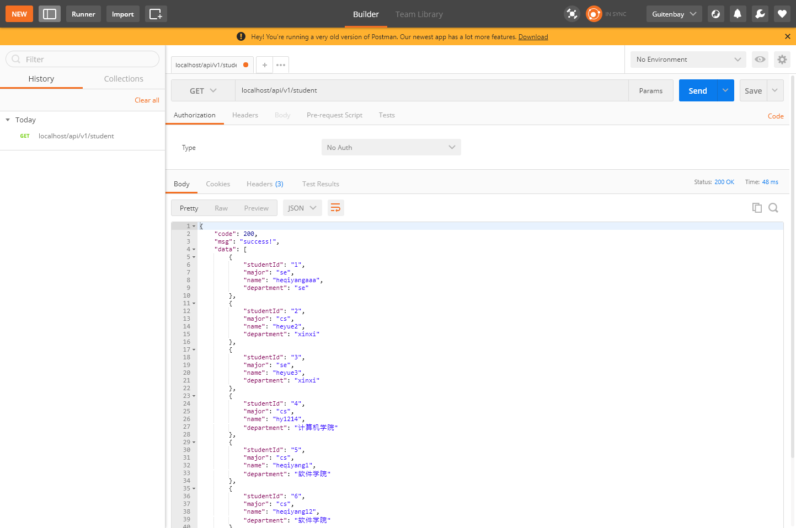

# 实验报告

## 项目部署文件目录

    - mysql: 放置 MySQL 启动相关配置文件、数据和初始数据库数据的文件夹
      - config: 包含 MySQL 启动相关配置文件
      - data: 包含 MySQL 数据内容
      - init: 初始化 MySQL 时，放置导入 sql 文件的文件夹
    - spring: 包含 Spring Boot 后端 Jar 包和 Dockerfile
    - .env: 环境变量配置文件
    - docker-compose.yml: docker 容器部署脚本

## 部署方法

1. 工具安装

    确保运行 docker 的计算机上安装有 `docker@19.03.12` 及以上版本和 `docker-compose@1.26.2` 及以上版本

2. Maven 打包
    
    Spring Boot 应用需要使用 Maven 打成 Jar 包，然后需要将 Jar 包重命名成 `lab.jar` 并移动到部署文件夹内的 `spring` 文件夹内

3. 部署

    在 `docker-compose.yml` 文件所在文件夹下运行:

        $ docker-compose up -d

    之后 MySQL 应用容器和 Spring Boot 应用容器就能在后台持续运行

## 封装方法描述

我们使用 `Dockerfile` 文件创建 docker 镜像：

```dockerfile
# 该镜像需要依赖的基础镜像
FROM maven:latest

# 将当前目录下的 jar 包复制到 docker 容器的/目录下
COPY lab.jar /lab.jar
# 声明服务运行在 8080 端口
EXPOSE 8080
# 指定docker容器启动时运行jar包
ENTRYPOINT ["java", "-jar","/lab.jar"]
```

使用 `docker-compose.yml` 构建 docker 容器集群

```yml
version: '3'

# 当容器内应用希望连接其他服务时
# 需要先让他们在一个网络中，然后通过 container_name 相互连接
# 注意：连接的域名需要全部改成 container_name
networks: 
  fdse-net:
    driver: bridge

services:
  mysql-fdse: # 容器名（container_name）
    # 指定镜像和版本
    image: mysql:5.7
    # 自启动
    restart: on-failure
    environment:
      TZ: Asis/Shanghai
      MYSQL_ROOT_PASSWORD: ${MYSQL_ROOT_PASSWORD}
      MYSQL_ROOT_HOST: ${MYSQL_ROOT_HOST}
    volumes:
      # 挂载数据目录
      - "${MYSQL_DIR}/data:/var/lib/mysql"
      # 挂载配置文件目录
      - "${MYSQL_DIR}/config/my.cnf:/etc/mysql/conf.d/my.cnf"
      # 挂载初始数据库数据目录
      - "${MYSQL_DIR}/init:/docker-entrypoint-initdb.d/"
    networks: 
      - fdse-net

  spring-fdse: # 容器名（container_name）
    # 从 spring 文件夹内的 Dockerfile 构建镜像
    build: ${SPRING_BOOT_DIR}/.
    # 设置端口映射
    ports:
      - "80:8080"
    # 设置该容器依赖项
    depends_on: 
      - mysql-fdse
    networks: 
      - fdse-net
```

## 检验

部署后，访问 docker 容器所在计算机提供的接口 `http://localhost/api/v1/student`（这是 spring-fdse 容器所运行的后端应用提供的接口），这里我部署在本机

访问接口如图即表示部署成功：



## 遇到的问题

1. 容器镜像构建时，如果你修改了 `Dockerfile` 文件必须运行如下命令删除之前创建的镜像
    
       $ docker image rm ${image-name}:${image-tag}

    否则，每次重新构建容器都是使用原来错误创建的镜像，这样永远无法部署成功

2. 构建容器集群时，如果容器内部需要连接其他容器：这里是 spring-fdse 容器需要连接 mysql-fdse 容器，则需要将这些容器配置在同一个网络下，因此 `docker-compose.yml` 文件中有以下代码：

    ```yml
    # 构建网络
    networks: 
      fdse-net:
        driver: bridge
    # 容器接入网络
    services:
      mysql-fdse: 
        ...
        networks: 
          - fdse-net
      spring-fdse: 
        ...
        networks: 
          - fdse-net
    ```

    > 注意，spring-fdse 需要连接 mysql-fdse 提供的 3306 端口访问 MySQL 服务，因此在 Spring Boot 后端应用的有关连接数据库的配置需要更改！
    >
    >   spring.datasource.url=jdbc:mysql://**mysql-fdse**:3306/student?characterEncoding=utf8&useSSL=false&allowMultiQueries=true&autoReconnect=true
    >
    > `mysql-fdse` 是要连接的容器的名称

## 一些新知识

- docker-compose 中 `links` 关键字和 `networks` 关键字

  `links` 和 `networks` 很类似。

  `links` 配置后，本容器就能与另一个容器相连接
  ```yml
  services:
    redis:
      ...
    app:
      links:
        - redis
  ```
  如上，app 就能连接 redis 了

  但是，`links` 已经被 `networks` 所取代。docker 将 `links` 描述为应该避免使用的遗留特性。

  使用 docker compose，`links` 会产生一个副作用，即它会创建一个隐含的依赖关系，上面使用 app 连接 redis，隐含着 app 需要依赖 redis。你应该用一个更显式的 `depends_on` 部分来替换它，这样 app 就不会尝试在没有 redis 或在 redis 启动之前运行。
